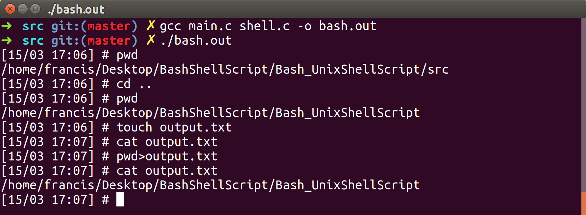

# Bash_UnixShellScript



A simple shell script designed to mimic the functionality of the bash terminal with a few slight changes.

## Features ##

#### *exec() and fork()* ####

The script will not be killed every time a command is entered as a new process is created for each command.

#### *Date in prompt* ####

The prompt displays the date and local time in the following format:

```
[dd/mm hh:mm]
```

#### *Catches SIGINT signal* ####

When the user types Ctrl + c the shell does not exit. Ctrl + d will still exit.

#### *Change directory builtin* ####

Program contains implementation of cd command.

#### *Redirect builtin* ####

Program contains implementation of redirect for ```stdout``` using ```>``` symbol.

```
ls>output.txt
```

### Usage ###

Compile the source files in to an executable file.
```
gcc -main.c -shell.c -o bash.out
```
Run the executable file in the console.
```
./bash.out
```
